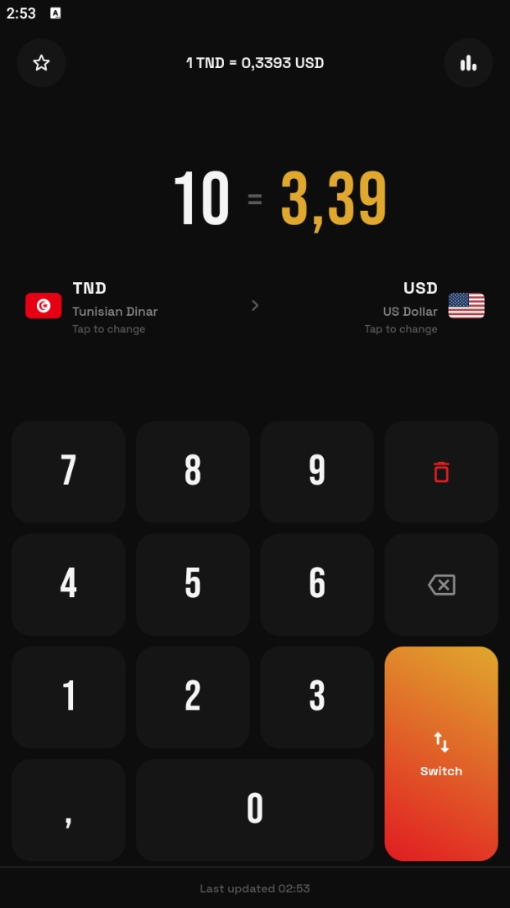
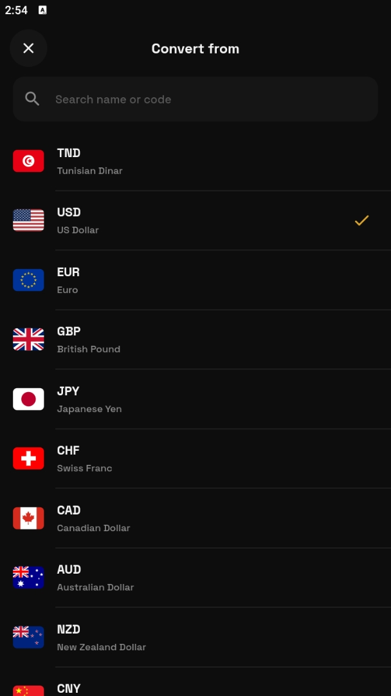
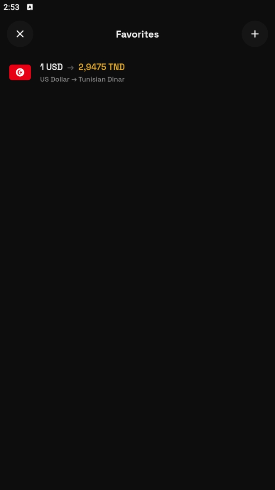
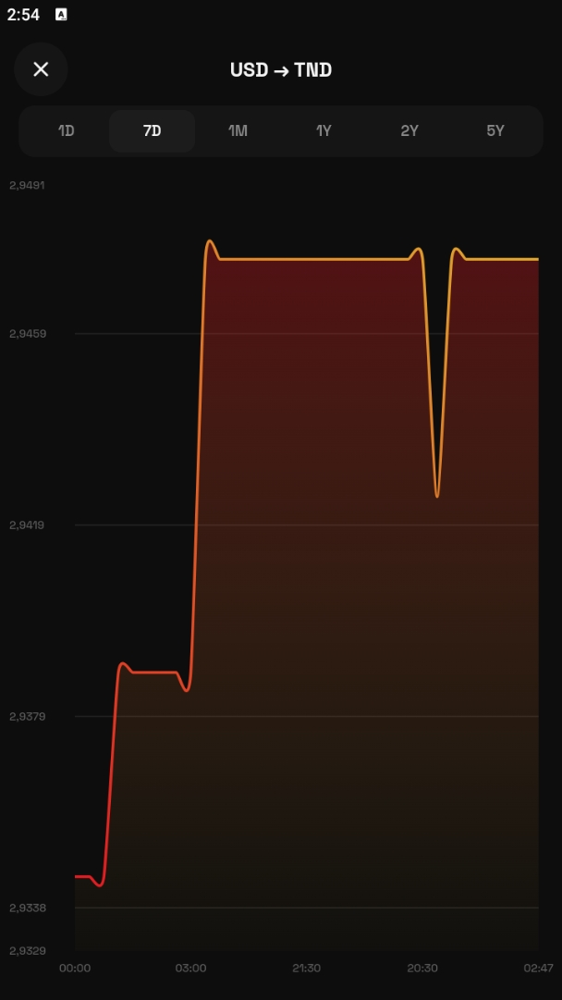

<!-- ============ HEADER BANNER ============ -->


<!-- ============ BADGES ============ -->
<p align="center">
  
  &nbsp;
  
  &nbsp;
  
  &nbsp;
  
</p>

<!-- ============ ANIMATED TAGLINE ============ -->
<p align="center">
  
</p>

<!-- ============ PLATFORM ROW ============ -->
<p align="center">
  
  
  
</p>

<!-- divider -->


<!-- ============ ABOUT ============ -->
<h2 align="center"> About</h2>

<p align="center">
  <b>Cambio</b> is a fast, tactile currency converter built with <b>Flutter</b> — one Dart codebase that renders
  <b>pixel-identical on Android and iOS</b>. Type on a full-screen keypad, flip between 45+ world currencies,
  save your favourite pairs, and view real historical charts.
</p>

<p align="center">
  Named after the Spanish/Italian word for <i>exchange</i> — what a currency booth is literally called — and
  dressed in a dark-luxe crimson &amp; gold theme.
</p>

<!-- divider -->


<!-- ============ PREVIEW ============ -->
<h2 align="center">🖼️ Preview</h2>

<p align="center"><i>Converter · Currency picker · Favourites · History chart</i></p>

<p align="center">
  <!-- Device screenshots live in /screenshots -->
  
  
  
  
</p>

<!-- divider -->


<!-- ============ FEATURES ============ -->
<h2 align="center">✨ Features</h2>

<p align="center">
⌨️ &nbsp;<b>Full-screen keypad</b> — big Bebas Neue numerals, decimal, delete-last, clear-all, and a one-tap switch<br/><br/>
🌍 &nbsp;<b>45+ currencies</b> — with rounded ISO flags, from USD &amp; EUR to TND, the Gulf dinars, and more<br/><br/>
📈 &nbsp;<b>Real history charts</b> — 1D · 7D · 1M · 1Y · 2Y · 5Y area charts in the crimson→gold gradient<br/><br/>
⭐ &nbsp;<b>Favourites</b> — save any pair, see live mini-rates at a glance, swipe to remove<br/><br/>
💾 &nbsp;<b>Remembers you</b> — your last pair and favourites persist between launches<br/><br/>
🎨 &nbsp;<b>One design, two platforms</b> — Flutter draws every pixel, so Android and iOS look identical
</p>

<!-- divider -->


<!-- ============ TECH STACK ============ -->
<h2 align="center">🧰 Tech Stack</h2>

<p align="center">
  <b>Framework</b><br/>
  
</p>
<p align="center">
  <b>Libraries</b><br/>
  <code>provider</code> · <code>fl_chart</code> · <code>http</code> · <code>shared_preferences</code> · <code>country_flags</code> · <code>google_fonts</code>
</p>

<!-- divider -->


<!-- ============ DATA ============ -->
<h2 align="center">📡 Where the rates come from</h2>

<p align="center">
  Cambio reads live and historical FX from <b>Yahoo Finance's public chart endpoint</b> — free, no API key,
  and one of the few sources that covers the <b>Tunisian Dinar (TND)</b> with intraday data.<br/>
  All parsing is isolated in <code>RateService</code> and fully unit-tested.
</p>

<!-- divider -->


<!-- ============ GETTING STARTED ============ -->
<h2 align="center">🚀 Getting Started</h2>

<p align="center"><b>Prerequisites</b> — Flutter <b>3.44+</b> · Android SDK (for APK) · Xcode (for iOS)</p>

```bash
flutter pub get

# Run on a connected device / emulator
flutter run

# Build a release APK (sideload on Android)
flutter build apk --release
#   → build/app/outputs/flutter-apk/app-release.apk

# Build for iOS (install via signing cert + a sideloader)
flutter build ipa
```

<!-- divider -->


<!-- ============ TESTS ============ -->
<h2 align="center">🧪 Tests</h2>

<p align="center">
  The pure logic — keypad input, number formatting, rate parsing, and the favourites store —
  is covered by <b>flutter_test</b>. No network, deterministic, fast.
</p>

```bash
flutter test
```

<p align="center">
  <b>43 tests</b> across <code>AmountInput</code>, the French-style formatters,
  <code>RateService.parse</code> + USD triangulation (incl. null gaps, markets-closed, and error responses),
  <code>ConverterState</code> conversion math, and the favourites serialization + store.
</p>

<!-- divider -->


<!-- ============ ARCHITECTURE ============ -->
<h2 align="center">⚙️ How It's Built</h2>

```
lib/
  main.dart              app entry + providers
  theme/                 brand palette + typography
  models/                Currency · RatePoint · ChartRange
  data/                  curated currency catalog
  services/              RateService — Yahoo fetch + pure parse
  state/                 AmountInput · ConverterState · FavoritesState
  screens/               converter · picker · favorites · chart
  widgets/               keypad · currency chip · flag · modal header
```

<p align="center">
  State is plain <code>ChangeNotifier</code> + <code>provider</code>. The keypad logic lives in a dependency-free
  <code>AmountInput</code> class so it's trivial to test, and all Yahoo parsing is a static pure function.
</p>

<!-- divider -->


<!-- ============ DISCLAIMER ============ -->
<h2 align="center">⚖️ Disclaimer</h2>

<p align="center">
  Cambio is an independent project and is <b>not affiliated with, endorsed by, or associated with</b>
  Yahoo or any data provider. Exchange rates are provided for reference only and may be delayed or inaccurate —
  do not rely on them for financial decisions. All trademarks belong to their respective owners.
</p>

<p align="center">
  <sub>© 2026 Anas Ben Ahmed · Provided "as is", without warranty of any kind.</sub>
</p>

<!-- ============ FOOTER WAVE ============ -->

