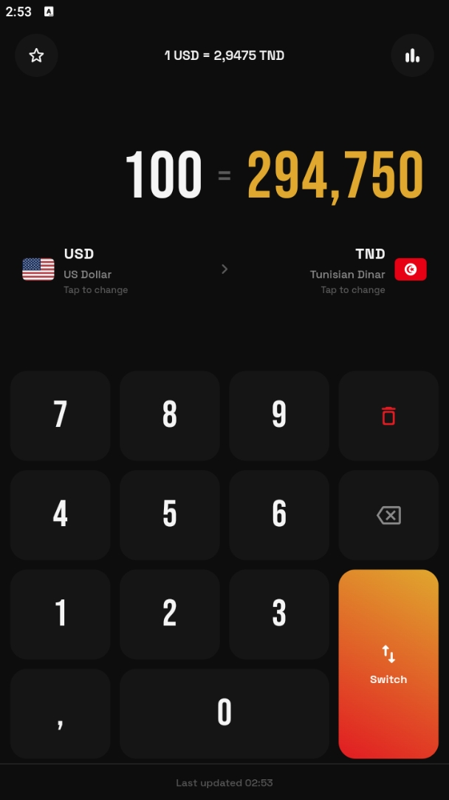

<!-- ============ HEADER BANNER ============ -->


<!-- ============ BADGES ============ -->
<p align="center">
  
  &nbsp;
  
  &nbsp;
  
  &nbsp;
  
</p>

<!-- ============ ANIMATED TAGLINE ============ -->
<p align="center">
  
</p>

<!-- ============ PLATFORM ROW ============ -->
<p align="center">
  
  
  
</p>

<!-- divider -->


<!-- ============ ABOUT ============ -->
<h2 align="center"> About</h2>

<p align="center">
  <b>Cambio</b> is a fast, tactile currency converter built with <b>Flutter</b> — one Dart codebase that renders
  <b>pixel-identical on Android and iOS</b>. Type on a full-screen keypad, flip between 45+ world currencies,
  save your favourite pairs, and view real historical charts.
</p>

<p align="center">
  Named after the Spanish/Italian word for <i>exchange</i> — what a currency booth is literally called — and
  dressed in a dark-luxe crimson &amp; gold theme.
</p>

<!-- divider -->


<!-- ============ PREVIEW ============ -->
<h2 align="center">🖼️ Preview</h2>

<p align="center"><i>Converter · Reverse pair · Currency picker · Favourites · History chart</i></p>

<p align="center">
  
  
  
  
  
</p>

<!-- divider -->


<!-- ============ FEATURES ============ -->
<h2 align="center">✨ Features</h2>

<p align="center">
⌨️ &nbsp;<b>Full-screen keypad</b> — big Bebas Neue numerals, decimal, delete-last, clear-all, and a one-tap switch<br/><br/>
🌍 &nbsp;<b>45+ currencies</b> — with rounded ISO flags, from USD &amp; EUR to TND, the Gulf dinars, and more<br/><br/>
📈 &nbsp;<b>Real history charts</b> — 1D · 7D · 1M · 1Y · 2Y · 5Y area charts in the crimson→gold gradient<br/><br/>
⭐ &nbsp;<b>Favourites</b> — save any pair, see live mini-rates at a glance, swipe to remove<br/><br/>
💾 &nbsp;<b>Remembers you</b> — your last pair and favourites persist between launches<br/><br/>
🎨 &nbsp;<b>One design, two platforms</b> — Flutter draws every pixel, so Android and iOS look identical
</p>

<!-- divider -->


<!-- ============ TECH STACK ============ -->
<h2 align="center">🧰 Tech Stack</h2>

<p align="center">
  <b>Framework</b><br/>
  
</p>
<p align="center">
  <b>Libraries</b><br/>
  <code>provider</code> · <code>fl_chart</code> · <code>http</code> · <code>shared_preferences</code> · <code>country_flags</code> · <code>google_fonts</code>
</p>

<!-- divider -->


<!-- ============ DATA ============ -->
<h2 align="center">📡 Where the rates come from</h2>

<p align="center">
  Cambio reads live and historical FX from <b>Yahoo Finance's public chart endpoint</b> — free, no API key,
  and one of the few sources that covers the <b>Tunisian Dinar (TND)</b> with intraday data.<br/>
  All parsing is isolated in <code>RateService</code> and fully unit-tested.
</p>

<!-- divider -->


<!-- ============ BUILD ============ -->
<h2 align="center">🛠️ Build from Source</h2>

<p align="center"><b>Prerequisites</b> — <a href="https://docs.flutter.dev/get-started/install">Flutter</a> <b>3.44.4</b> (stable). Android SDK for the APK; macOS + Xcode <i>or</i> GitHub Actions for the IPA.</p>

```bash
git clone https://github.com/AnasBenAhmed/Cambio.git
cd Cambio
flutter pub get
flutter test     # 43 unit tests
flutter run      # launch on a connected device / emulator
```

<h3>🤖 Android (APK)</h3>

```bash
# Universal APK — works on any phone (~50 MB, bundles all CPU ABIs)
flutter build apk --release
#   → build/app/outputs/flutter-apk/app-release.apk

# Or smaller per-architecture APKs (~16 MB each)
flutter build apk --release --split-per-abi
#   → app-arm64-v8a-release.apk   ← most modern phones
```

Copy the `.apk` to your phone and open it (enable **Install from unknown sources**).

<h3>🍎 iOS (IPA)</h3>

iOS binaries can **only be compiled on macOS** (Xcode is required) — there's no way around that on Windows/Linux locally. Two paths:

**A · On a Mac**

```bash
flutter build ipa --release   # signing configured via Xcode / your Apple account
```

**B · From Windows/Linux — build in the cloud with GitHub Actions (free on public repos)**

This repo ships a workflow that builds an **unsigned** `.ipa` on a macOS runner — ideal for re-signing on-device with **ESign** or **Sideloadly** (they apply *your* certificate at install time, so an unsigned build is exactly what you want).

1. Make sure `.github/workflows/ios.yml` exists in your repo *(see the block below if you need to add it)*.
2. On GitHub, open the **Actions** tab → select **“iOS build (unsigned IPA)”** → **Run workflow** → **Run**.
3. Wait ~10–15 min. Open the finished run and download the **`Cambio-unsigned-ipa`** artifact (a zip containing `Cambio-unsigned.ipa`).
4. Send the `.ipa` to your iPhone and install it with your certificate through **ESign** / **Sideloadly**.

<details>
<summary><b>📄 <code>.github/workflows/ios.yml</code></b> — add this via GitHub → <i>Add file → Create new file</i> if it's not already there</summary>

```yaml
name: iOS build (unsigned IPA)

on:
  workflow_dispatch:
  push:
    tags: ['v*']

jobs:
  build-ios:
    runs-on: macos-latest
    steps:
      - uses: actions/checkout@v4
      - uses: subosito/flutter-action@v2
        with:
          channel: stable
          flutter-version: 3.44.4
          cache: true
      - run: flutter pub get
      - run: flutter build ios --release --no-codesign
      - name: Package unsigned IPA
        run: |
          cd build/ios/iphoneos
          mkdir -p Payload
          cp -R Runner.app Payload/Runner.app
          zip -r -y "$GITHUB_WORKSPACE/Cambio-unsigned.ipa" Payload
      - uses: actions/upload-artifact@v4
        with:
          name: Cambio-unsigned-ipa
          path: Cambio-unsigned.ipa
          if-no-files-found: error
```

</details>

<!-- divider -->


<!-- ============ TESTS ============ -->
<h2 align="center">🧪 Tests</h2>

<p align="center">
  The pure logic — keypad input, number formatting, rate parsing, and the favourites store —
  is covered by <b>flutter_test</b>. No network, deterministic, fast.
</p>

```bash
flutter test
```

<p align="center">
  <b>43 tests</b> across <code>AmountInput</code>, the French-style formatters,
  <code>RateService.parse</code> + USD triangulation (incl. null gaps, markets-closed, and error responses),
  <code>ConverterState</code> conversion math, and the favourites serialization + store.
</p>

<!-- divider -->


<!-- ============ ARCHITECTURE ============ -->
<h2 align="center">⚙️ How It's Built</h2>

```
lib/
  main.dart              app entry + providers
  theme/                 brand palette + typography
  models/                Currency · RatePoint · ChartRange
  data/                  curated currency catalog
  services/              RateService — Yahoo fetch + pure parse
  state/                 AmountInput · ConverterState · FavoritesState
  screens/               converter · picker · favorites · chart
  widgets/               keypad · currency chip · flag · modal header
```

<p align="center">
  State is plain <code>ChangeNotifier</code> + <code>provider</code>. The keypad logic lives in a dependency-free
  <code>AmountInput</code> class so it's trivial to test, and all Yahoo parsing is a static pure function.
</p>

<!-- divider -->


<!-- ============ DISCLAIMER ============ -->
<h2 align="center">⚖️ Disclaimer</h2>

<p align="center">
  Cambio is an independent project and is <b>not affiliated with, endorsed by, or associated with</b>
  Yahoo or any data provider. Exchange rates are provided for reference only and may be delayed or inaccurate —
  do not rely on them for financial decisions. All trademarks belong to their respective owners.
</p>

<p align="center">
  <sub>© 2026 Anas Ben Ahmed · Provided "as is", without warranty of any kind.</sub>
</p>

<!-- ============ FOOTER WAVE ============ -->

